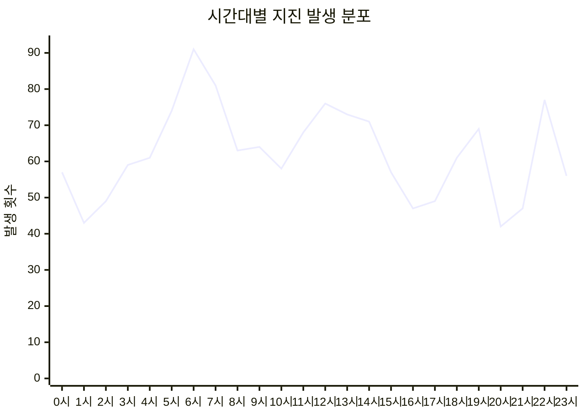

# 시간대별 지진 발생 분포

```mermaid
xychart-beta
    title "시간대별 지진 발생 분포"
    x-axis ["0시", "1시", "2시", "3시", "4시", "5시", "6시", "7시", "8시", "9시", "10시", "11시", "12시", "13시", "14시", "15시", "16시", "17시", "18시", "19시", "20시", "21시", "22시", "23시"]
    y-axis "발생 횟수" 0 --> 93
    line [57, 43, 49, 59, 61, 74, 91, 81, 63, 64, 58, 68, 76, 73, 71, 57, 47, 49, 61, 69, 42, 47, 77, 56]
```

업데이트 시간: 2025-07-06 12:05:48
