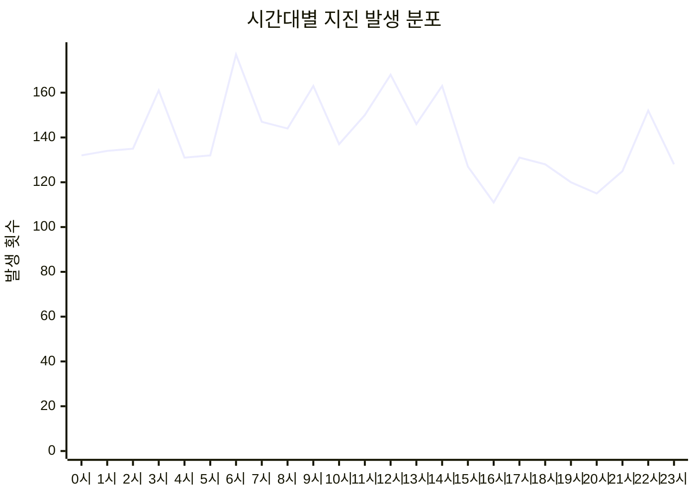

# 시간대별 지진 발생 분포

```mermaid
xychart-beta
    title "시간대별 지진 발생 분포"
    x-axis ["0시", "1시", "2시", "3시", "4시", "5시", "6시", "7시", "8시", "9시", "10시", "11시", "12시", "13시", "14시", "15시", "16시", "17시", "18시", "19시", "20시", "21시", "22시", "23시"]
    y-axis "발생 횟수" 0 --> 179
    line [132, 134, 135, 161, 131, 132, 177, 147, 144, 163, 137, 150, 168, 146, 163, 127, 111, 131, 128, 120, 115, 125, 152, 128]
```

업데이트 시간: 2026-01-06 06:07:19
