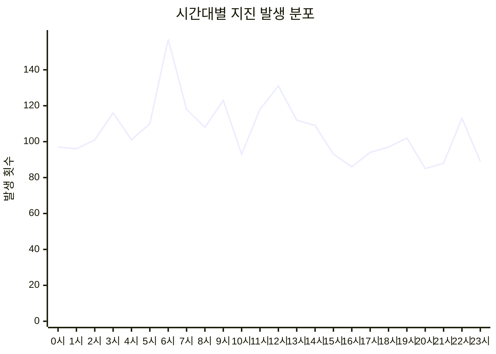

# 시간대별 지진 발생 분포

```mermaid
xychart-beta
    title "시간대별 지진 발생 분포"
    x-axis ["0시", "1시", "2시", "3시", "4시", "5시", "6시", "7시", "8시", "9시", "10시", "11시", "12시", "13시", "14시", "15시", "16시", "17시", "18시", "19시", "20시", "21시", "22시", "23시"]
    y-axis "발생 횟수" 0 --> 159
    line [97, 96, 101, 116, 101, 110, 157, 118, 108, 123, 93, 118, 131, 112, 109, 93, 86, 94, 97, 102, 85, 88, 113, 89]
```

업데이트 시간: 2025-09-11 15:04:09
