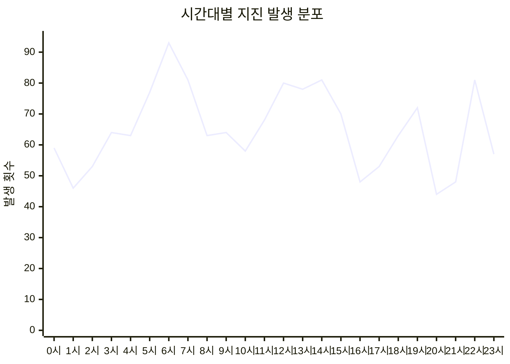

# 시간대별 지진 발생 분포

```mermaid
xychart-beta
    title "시간대별 지진 발생 분포"
    x-axis ["0시", "1시", "2시", "3시", "4시", "5시", "6시", "7시", "8시", "9시", "10시", "11시", "12시", "13시", "14시", "15시", "16시", "17시", "18시", "19시", "20시", "21시", "22시", "23시"]
    y-axis "발생 횟수" 0 --> 95
    line [59, 46, 53, 64, 63, 77, 93, 81, 63, 64, 58, 68, 80, 78, 81, 70, 48, 53, 63, 72, 44, 48, 81, 57]
```

업데이트 시간: 2025-07-07 07:05:18
