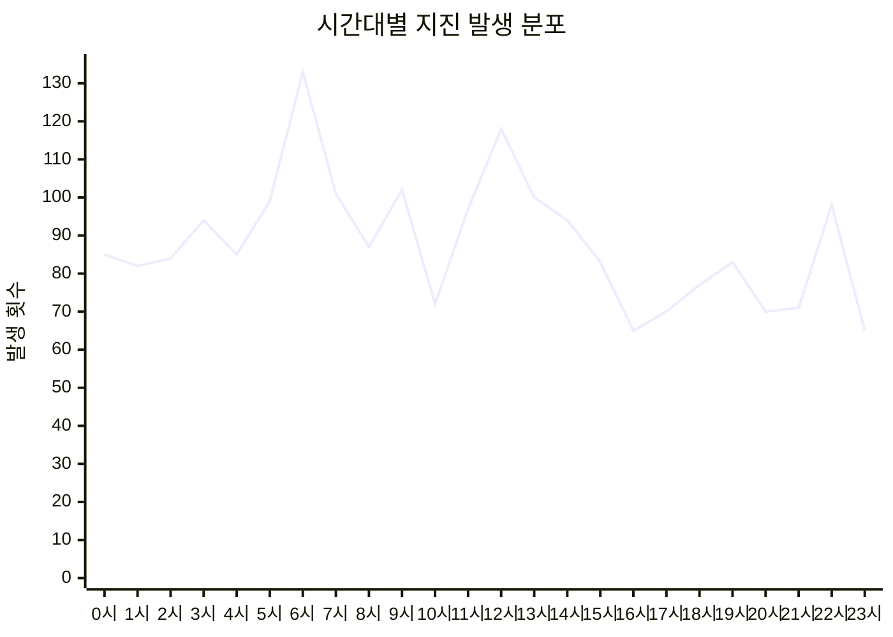

# 시간대별 지진 발생 분포

```mermaid
xychart-beta
    title "시간대별 지진 발생 분포"
    x-axis ["0시", "1시", "2시", "3시", "4시", "5시", "6시", "7시", "8시", "9시", "10시", "11시", "12시", "13시", "14시", "15시", "16시", "17시", "18시", "19시", "20시", "21시", "22시", "23시"]
    y-axis "발생 횟수" 0 --> 135
    line [85, 82, 84, 94, 85, 99, 133, 101, 87, 102, 72, 97, 118, 100, 94, 83, 65, 70, 77, 83, 70, 71, 98, 65]
```

업데이트 시간: 2025-07-19 10:03:58
