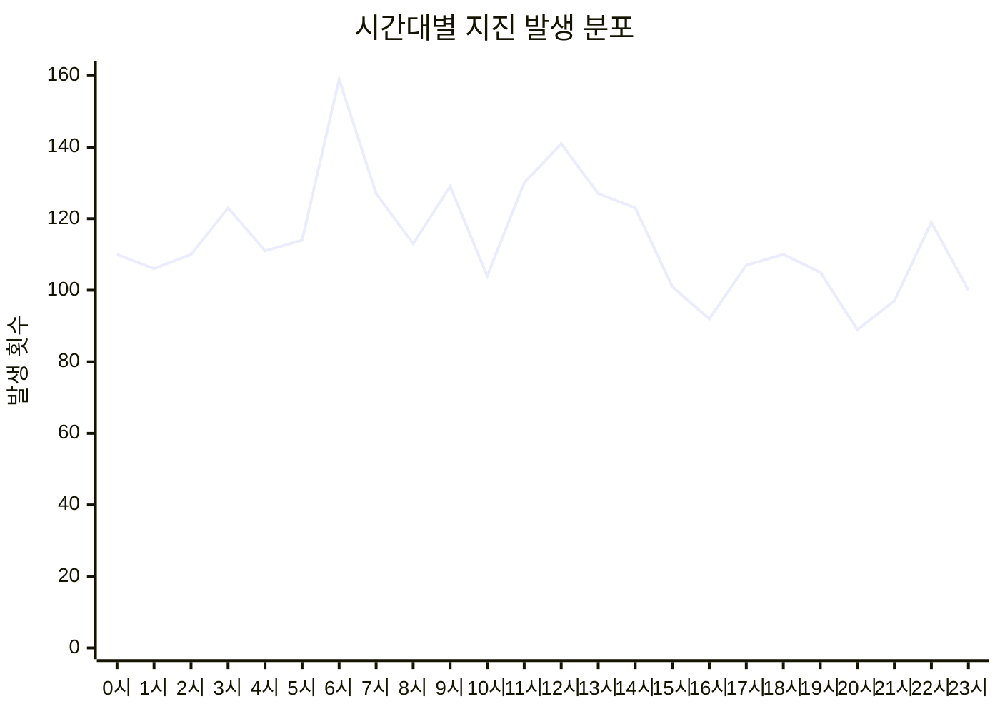

# 시간대별 지진 발생 분포

```mermaid
xychart-beta
    title "시간대별 지진 발생 분포"
    x-axis ["0시", "1시", "2시", "3시", "4시", "5시", "6시", "7시", "8시", "9시", "10시", "11시", "12시", "13시", "14시", "15시", "16시", "17시", "18시", "19시", "20시", "21시", "22시", "23시"]
    y-axis "발생 횟수" 0 --> 161
    line [110, 106, 110, 123, 111, 114, 159, 127, 113, 129, 104, 130, 141, 127, 123, 101, 92, 107, 110, 105, 89, 97, 119, 100]
```

업데이트 시간: 2025-10-02 23:04:07
