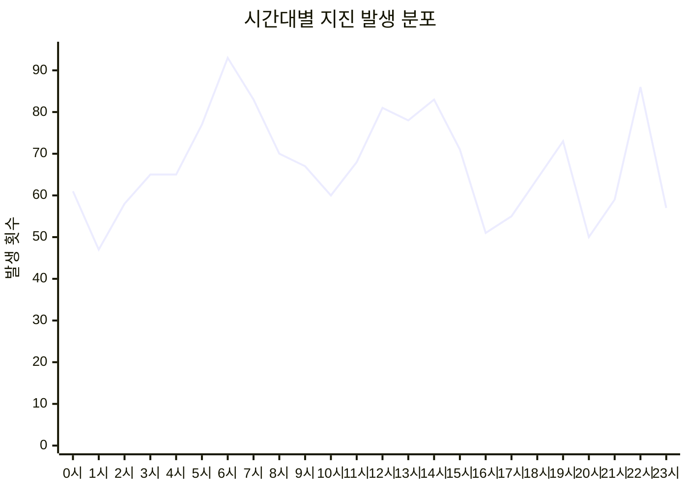

# 시간대별 지진 발생 분포

```mermaid
xychart-beta
    title "시간대별 지진 발생 분포"
    x-axis ["0시", "1시", "2시", "3시", "4시", "5시", "6시", "7시", "8시", "9시", "10시", "11시", "12시", "13시", "14시", "15시", "16시", "17시", "18시", "19시", "20시", "21시", "22시", "23시"]
    y-axis "발생 횟수" 0 --> 95
    line [61, 47, 58, 65, 65, 77, 93, 83, 70, 67, 60, 68, 81, 78, 83, 71, 51, 55, 64, 73, 50, 59, 86, 57]
```

업데이트 시간: 2025-07-08 05:05:11
