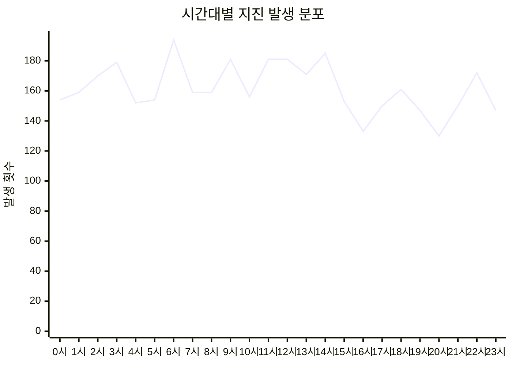

# 시간대별 지진 발생 분포

```mermaid
xychart-beta
    title "시간대별 지진 발생 분포"
    x-axis ["0시", "1시", "2시", "3시", "4시", "5시", "6시", "7시", "8시", "9시", "10시", "11시", "12시", "13시", "14시", "15시", "16시", "17시", "18시", "19시", "20시", "21시", "22시", "23시"]
    y-axis "발생 횟수" 0 --> 196
    line [154, 159, 170, 179, 152, 154, 194, 159, 159, 181, 156, 181, 181, 171, 185, 153, 133, 150, 161, 147, 130, 150, 172, 147]
```

업데이트 시간: 2026-03-23 21:12:33
