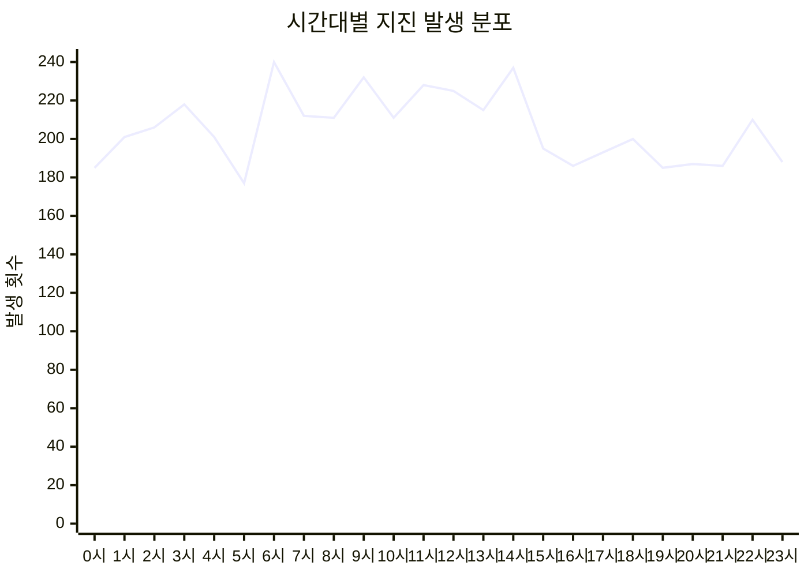

# 시간대별 지진 발생 분포

```mermaid
xychart-beta
    title "시간대별 지진 발생 분포"
    x-axis ["0시", "1시", "2시", "3시", "4시", "5시", "6시", "7시", "8시", "9시", "10시", "11시", "12시", "13시", "14시", "15시", "16시", "17시", "18시", "19시", "20시", "21시", "22시", "23시"]
    y-axis "발생 횟수" 0 --> 242
    line [185, 201, 206, 218, 201, 177, 240, 212, 211, 232, 211, 228, 225, 215, 237, 195, 186, 193, 200, 185, 187, 186, 210, 188]
```

업데이트 시간: 2026-08-01 03:17:44
