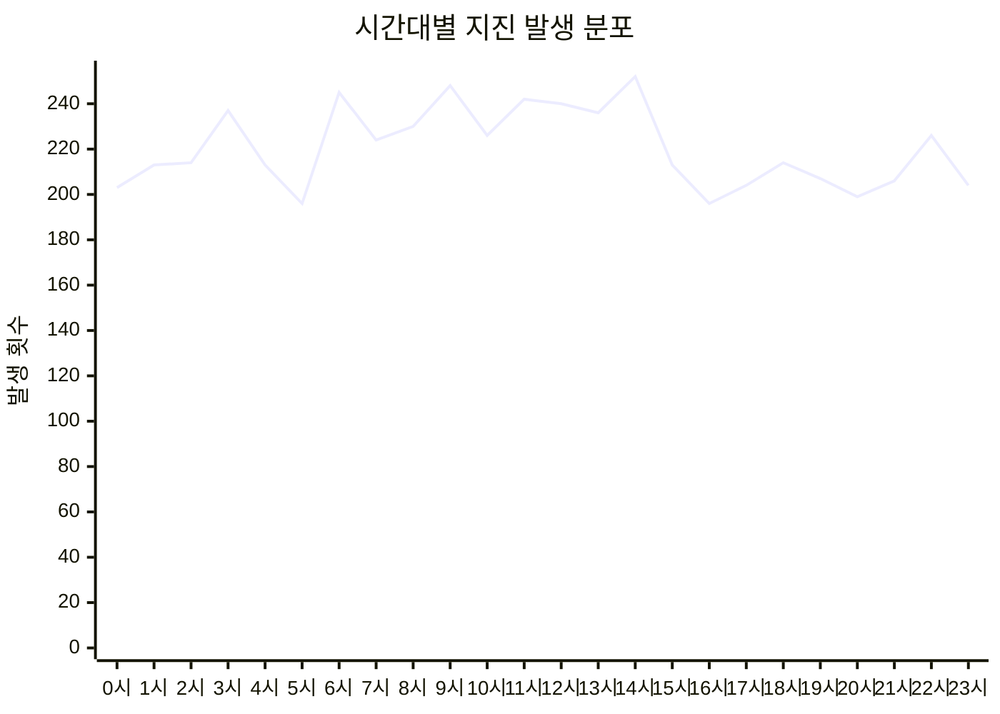

# 시간대별 지진 발생 분포

```mermaid
xychart-beta
    title "시간대별 지진 발생 분포"
    x-axis ["0시", "1시", "2시", "3시", "4시", "5시", "6시", "7시", "8시", "9시", "10시", "11시", "12시", "13시", "14시", "15시", "16시", "17시", "18시", "19시", "20시", "21시", "22시", "23시"]
    y-axis "발생 횟수" 0 --> 254
    line [203, 213, 214, 237, 213, 196, 245, 224, 230, 248, 226, 242, 240, 236, 252, 213, 196, 204, 214, 207, 199, 206, 226, 204]
```

업데이트 시간: 2026-08-23 16:19:54
