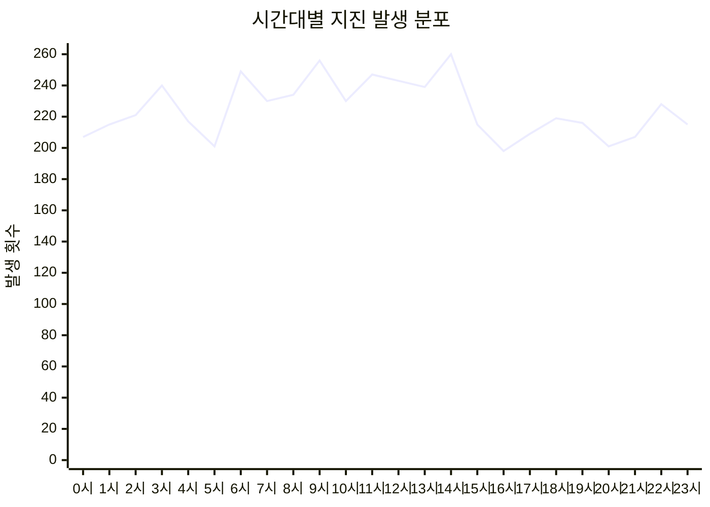

# 시간대별 지진 발생 분포

```mermaid
xychart-beta
    title "시간대별 지진 발생 분포"
    x-axis ["0시", "1시", "2시", "3시", "4시", "5시", "6시", "7시", "8시", "9시", "10시", "11시", "12시", "13시", "14시", "15시", "16시", "17시", "18시", "19시", "20시", "21시", "22시", "23시"]
    y-axis "발생 횟수" 0 --> 262
    line [207, 215, 221, 240, 217, 201, 249, 230, 234, 256, 230, 247, 243, 239, 260, 215, 198, 209, 219, 216, 201, 207, 228, 215]
```

업데이트 시간: 2026-09-07 23:56:58
