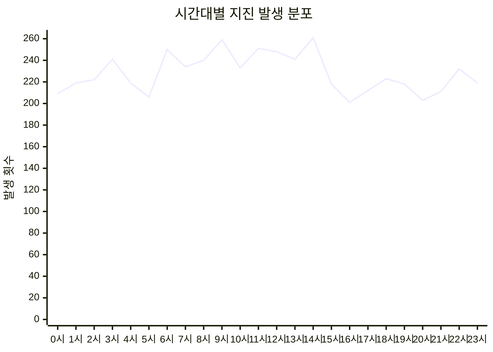

# 시간대별 지진 발생 분포

```mermaid
xychart-beta
    title "시간대별 지진 발생 분포"
    x-axis ["0시", "1시", "2시", "3시", "4시", "5시", "6시", "7시", "8시", "9시", "10시", "11시", "12시", "13시", "14시", "15시", "16시", "17시", "18시", "19시", "20시", "21시", "22시", "23시"]
    y-axis "발생 횟수" 0 --> 263
    line [209, 219, 222, 241, 219, 206, 250, 234, 240, 259, 233, 251, 248, 241, 261, 218, 201, 212, 223, 218, 203, 211, 232, 219]
```

업데이트 시간: 2026-09-19 15:16:16
