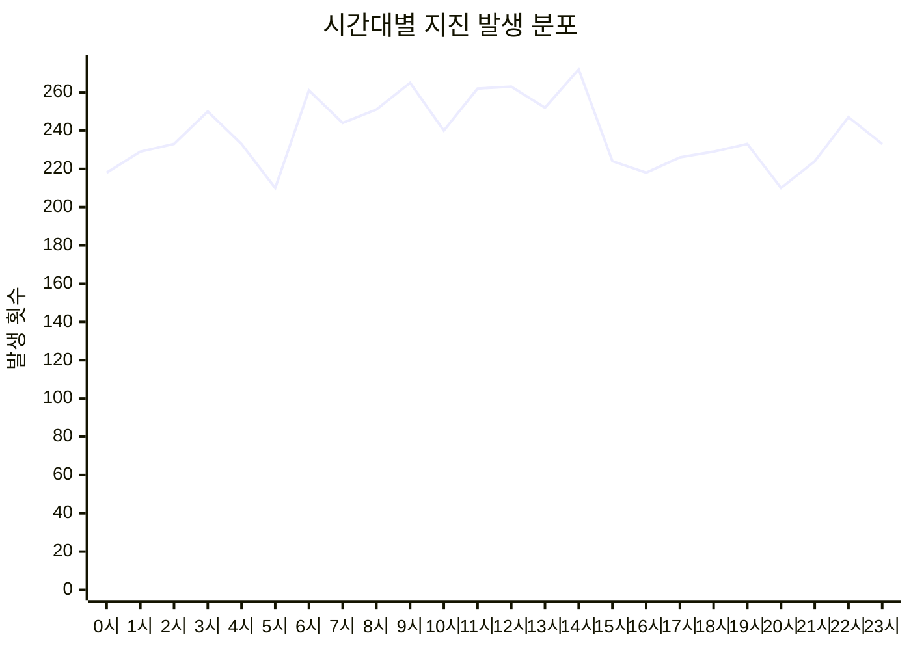

# 시간대별 지진 발생 분포

```mermaid
xychart-beta
    title "시간대별 지진 발생 분포"
    x-axis ["0시", "1시", "2시", "3시", "4시", "5시", "6시", "7시", "8시", "9시", "10시", "11시", "12시", "13시", "14시", "15시", "16시", "17시", "18시", "19시", "20시", "21시", "22시", "23시"]
    y-axis "발생 횟수" 0 --> 274
    line [218, 229, 233, 250, 233, 210, 261, 244, 251, 265, 240, 262, 263, 252, 272, 224, 218, 226, 229, 233, 210, 224, 247, 233]
```

업데이트 시간: 2026-11-01 16:45:11
