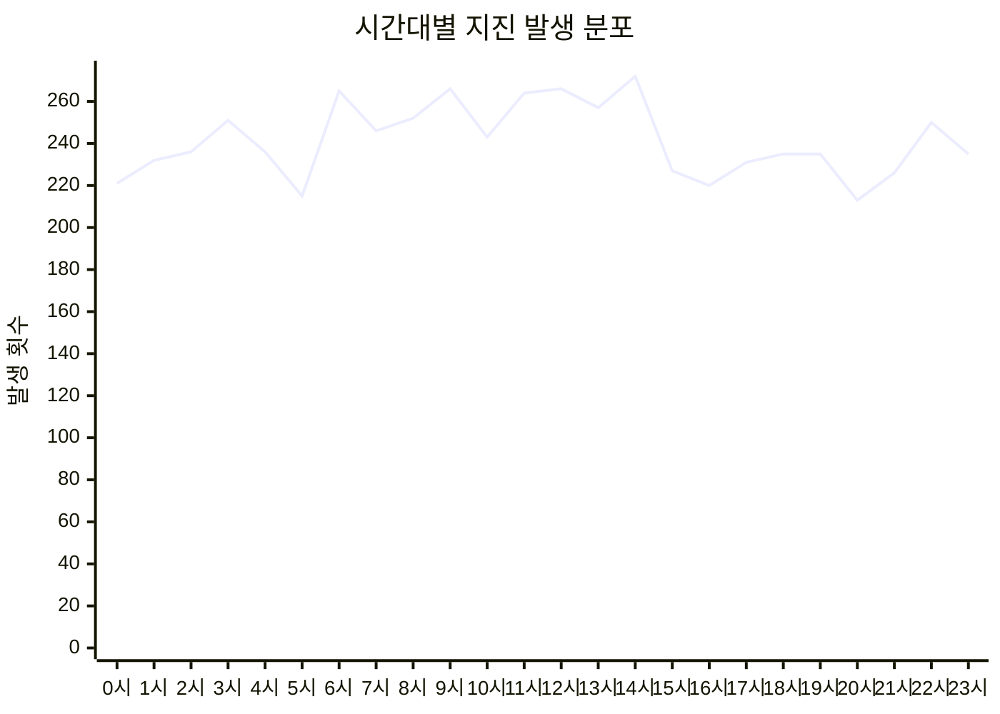

# 시간대별 지진 발생 분포

```mermaid
xychart-beta
    title "시간대별 지진 발생 분포"
    x-axis ["0시", "1시", "2시", "3시", "4시", "5시", "6시", "7시", "8시", "9시", "10시", "11시", "12시", "13시", "14시", "15시", "16시", "17시", "18시", "19시", "20시", "21시", "22시", "23시"]
    y-axis "발생 횟수" 0 --> 274
    line [221, 232, 236, 251, 236, 215, 265, 246, 252, 266, 243, 264, 266, 257, 272, 227, 220, 231, 235, 235, 213, 226, 250, 235]
```

업데이트 시간: 2026-11-14 08:32:09
