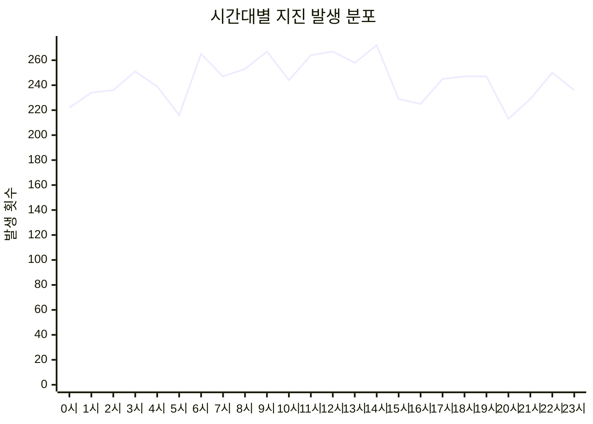

# 시간대별 지진 발생 분포

```mermaid
xychart-beta
    title "시간대별 지진 발생 분포"
    x-axis ["0시", "1시", "2시", "3시", "4시", "5시", "6시", "7시", "8시", "9시", "10시", "11시", "12시", "13시", "14시", "15시", "16시", "17시", "18시", "19시", "20시", "21시", "22시", "23시"]
    y-axis "발생 횟수" 0 --> 274
    line [222, 234, 236, 251, 239, 216, 265, 247, 253, 267, 244, 264, 267, 258, 272, 229, 225, 245, 247, 247, 213, 229, 250, 236]
```

업데이트 시간: 2026-11-18 19:55:40
