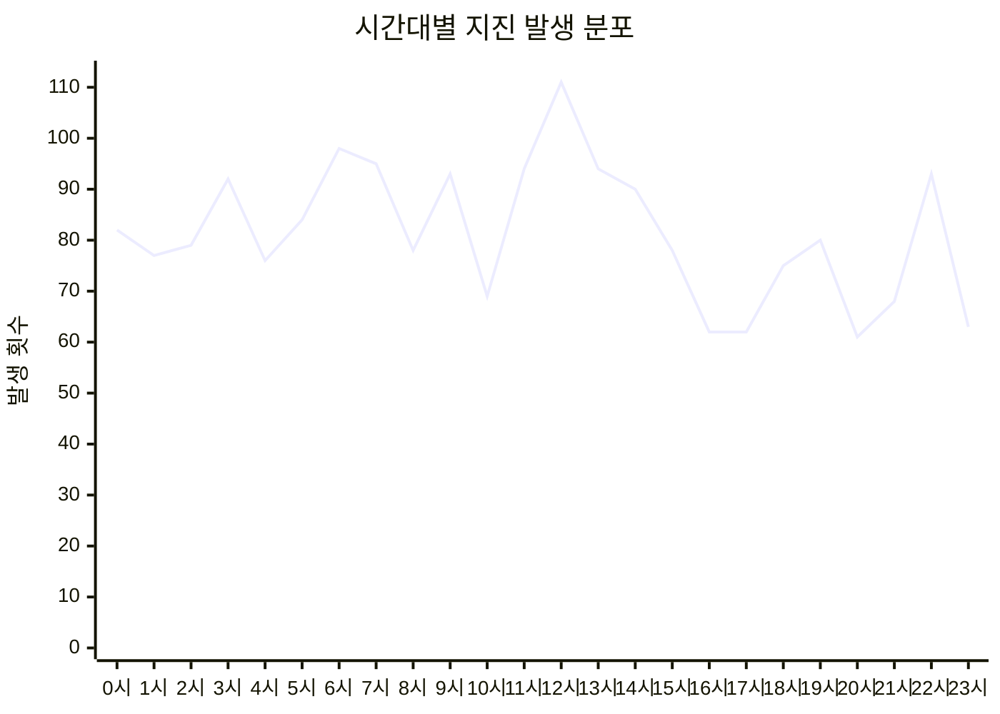

# 시간대별 지진 발생 분포

```mermaid
xychart-beta
    title "시간대별 지진 발생 분포"
    x-axis ["0시", "1시", "2시", "3시", "4시", "5시", "6시", "7시", "8시", "9시", "10시", "11시", "12시", "13시", "14시", "15시", "16시", "17시", "18시", "19시", "20시", "21시", "22시", "23시"]
    y-axis "발생 횟수" 0 --> 113
    line [82, 77, 79, 92, 76, 84, 98, 95, 78, 93, 69, 94, 111, 94, 90, 78, 62, 62, 75, 80, 61, 68, 93, 63]
```

업데이트 시간: 2025-07-14 05:08:13
