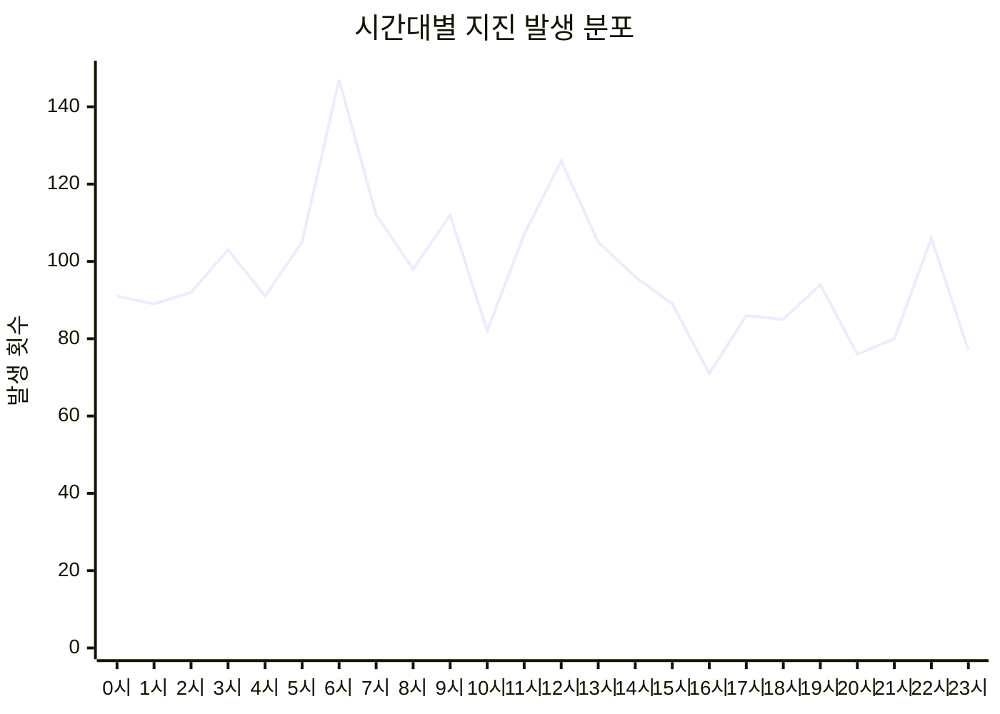

# 시간대별 지진 발생 분포

```mermaid
xychart-beta
    title "시간대별 지진 발생 분포"
    x-axis ["0시", "1시", "2시", "3시", "4시", "5시", "6시", "7시", "8시", "9시", "10시", "11시", "12시", "13시", "14시", "15시", "16시", "17시", "18시", "19시", "20시", "21시", "22시", "23시"]
    y-axis "발생 횟수" 0 --> 149
    line [91, 89, 92, 103, 91, 105, 147, 112, 98, 112, 82, 107, 126, 105, 96, 89, 71, 86, 85, 94, 76, 80, 106, 77]
```

업데이트 시간: 2025-08-12 03:25:43
